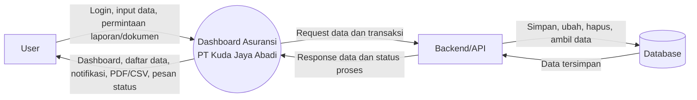
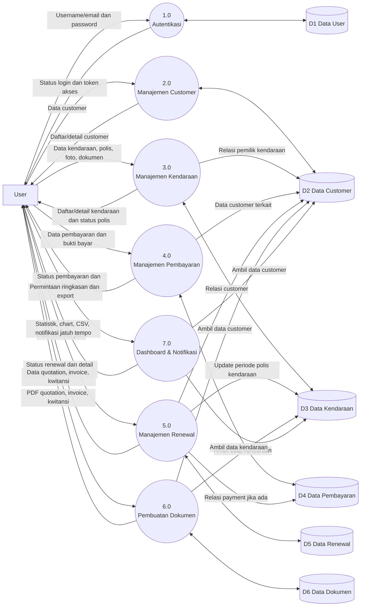
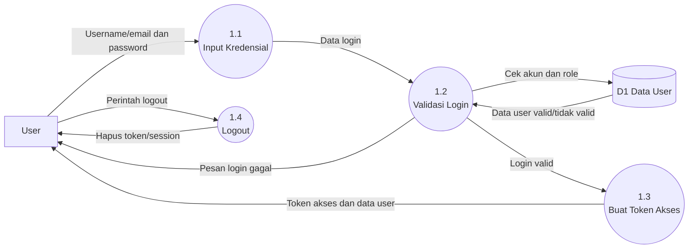
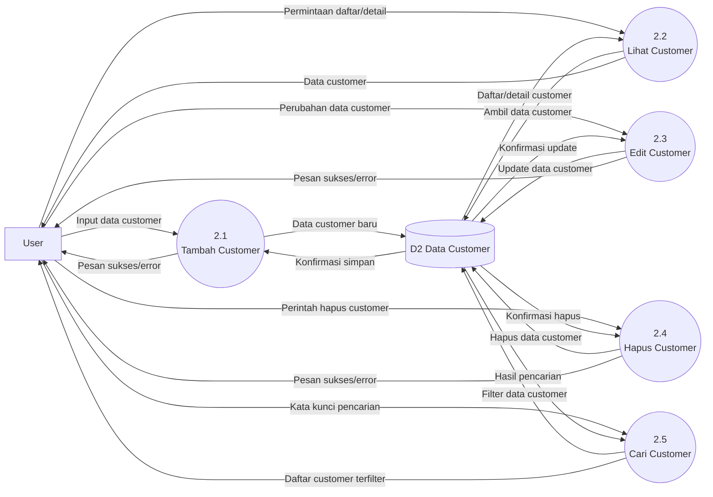
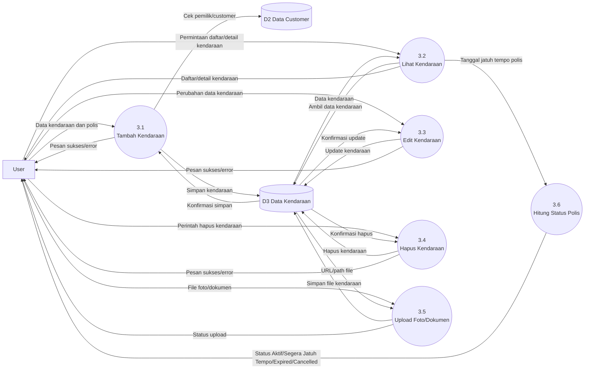
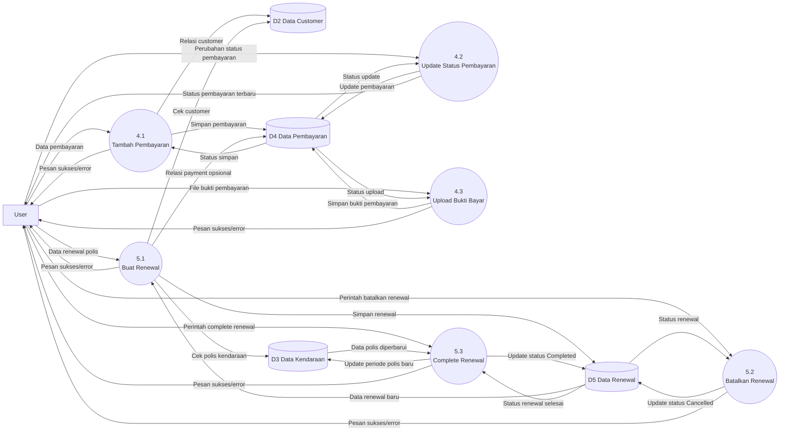
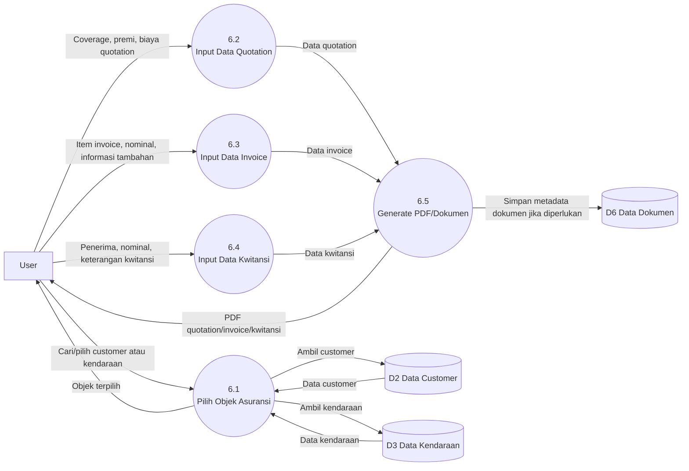
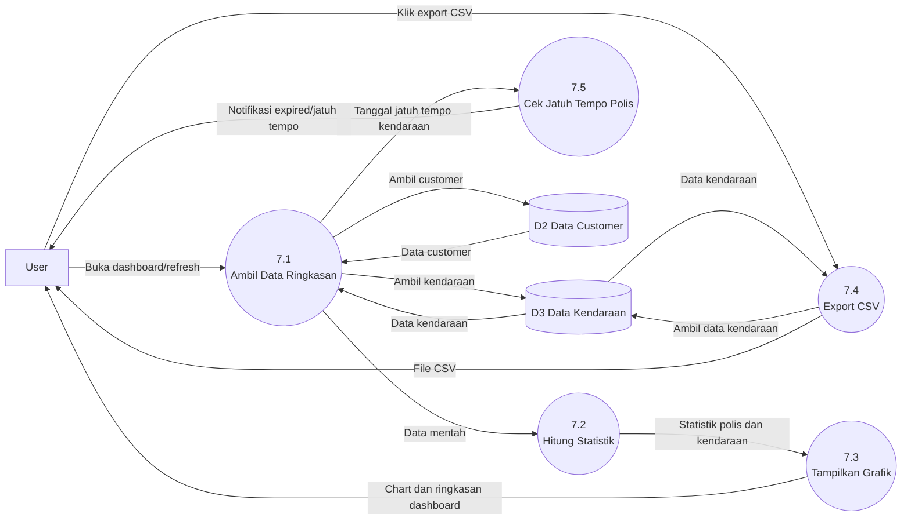

# Data Flow Diagram (DFD)

## 1. Informasi Dokumen

| Item | Keterangan |
| --- | --- |
| Nama Sistem | Dashboard Asuransi PT Kuda Jaya Abadi |
| Jenis Dokumen | Data Flow Diagram (DFD) |
| Versi | 1.0 |
| Tanggal | 21 Mei 2026 |
| Penyusun | Tim Pengembang |

## 2. Tujuan

Dokumen Data Flow Diagram (DFD) ini dibuat untuk menggambarkan aliran data pada sistem Dashboard Asuransi PT Kuda Jaya Abadi. DFD menjelaskan bagaimana data masuk ke sistem, diproses, disimpan, dan ditampilkan kembali kepada pengguna.

## 3. External Entity

| Entity | Deskripsi |
| --- | --- |
| User | Pengguna sistem yang mengelola customer, kendaraan, pembayaran, renewal, quotation, invoice, dan kwitansi |
| Backend/API | Layanan server yang menerima request dari dashboard dan menghubungkan sistem dengan database |
| Database | Tempat penyimpanan data user, customer, kendaraan, pembayaran, renewal, dan dokumen |

## 4. Data Store

| Kode | Data Store | Isi Data |
| --- | --- | --- |
| D1 | Data User | Username, email, password terenkripsi, dan profil user |
| D2 | Data Customer | Identitas customer, alamat, kontak, dan data nasabah |
| D3 | Data Kendaraan | Data mobil, nomor plat, pemilik, nilai kendaraan, polis, foto, dan dokumen kendaraan |
| D4 | Data Pembayaran | Data pembayaran premi, nominal, status pembayaran, dan bukti pembayaran |
| D5 | Data Renewal | Data perpanjangan polis, periode baru, premi, status, dan catatan |
| D6 | Data Dokumen | Data quotation, invoice, kwitansi, dan profil perusahaan |

## 5. Context Diagram

Context Diagram menggambarkan sistem sebagai satu proses utama yang berinteraksi dengan pengguna dan penyimpanan data melalui backend/API.

## 6. DFD Level 0

DFD Level 0 memecah sistem menjadi beberapa proses utama berdasarkan fitur aplikasi.

## 7. DFD Level 1 - Autentikasi

## 8. DFD Level 1 - Manajemen Customer

## 9. DFD Level 1 - Manajemen Kendaraan

## 10. DFD Level 1 - Pembayaran dan Renewal

## 11. DFD Level 1 - Pembuatan Dokumen

## 12. DFD Level 1 - Dashboard dan Notifikasi

## 13. Kamus Aliran Data

| Aliran Data | Isi Data |
| --- | --- |
| Data Login | Username/email, password |
| Token Akses | Token autentikasi untuk mengakses endpoint protected |
| Data Customer | Nama, alamat, kontak, email, dan informasi identitas customer |
| Data Kendaraan | Merek, model, nomor plat, harga, pemilik, tanggal jatuh tempo polis, status |
| File Kendaraan | Foto kendaraan dan dokumen pendukung seperti STNK/SIM/KTP |
| Data Pembayaran | Customer, nominal pembayaran, tanggal pembayaran, status, bukti bayar |
| Data Renewal | Customer, tipe polis, polis lama, periode baru, premi, payment, status, catatan |
| Data Quotation | Objek asuransi, coverage, premi, biaya tambahan, profil perusahaan |
| Data Invoice | Objek asuransi, item biaya, nominal, total, profil perusahaan |
| Data Kwitansi | Penerima, nominal, tanggal, keterangan pembayaran |
| Data Dashboard | Statistik kendaraan, status polis, chart, daftar data terbaru |
| Data Notifikasi | Polis expired dan polis yang akan jatuh tempo |
| Data User | Username, email, password terenkripsi, dan profil user |

## 14. Catatan

1. DFD ini dibuat berdasarkan fitur pada aplikasi dashboard dan endpoint API yang digunakan oleh frontend.
2. Penyimpanan fisik data dilakukan melalui Backend/API dan database aplikasi.
3. Dokumen quotation, invoice, dan kwitansi dihasilkan oleh sistem dalam bentuk file PDF/dokumen yang dapat digunakan oleh user.
4. Sistem digunakan oleh user sebagai pengguna utama tanpa modul pengelolaan pengguna terpisah.
